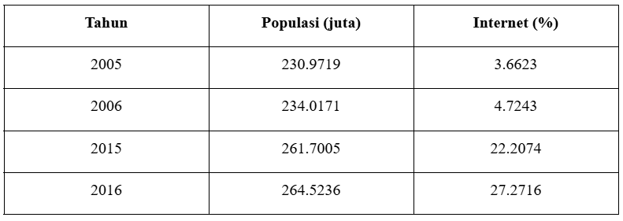
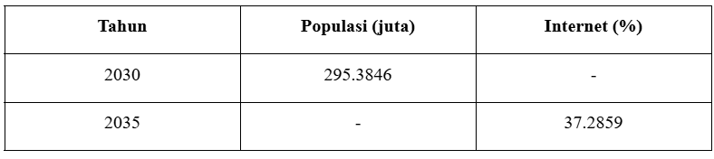
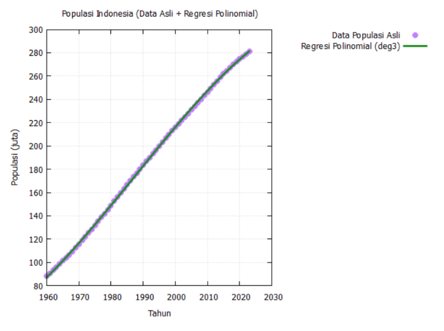
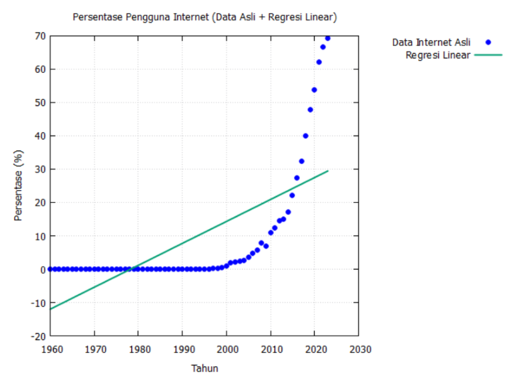

# Analisis dan Visualisasi Data: Curve Fitting, Regresi, dan Interpolasi

##  Deskripsi Proyek

Proyek ini merupakan bagian dari Tugas Akhir Pemrograman A yang bertujuan untuk menganalisis pertumbuhan populasi Indonesia dan adopsi Internet dari tahun 1960 hingga 2023. Proyek ini menggunakan teknik interpolasi linier untuk mengisi data yang hilang dan melakukan regresi (polinomial dan linear) untuk membuat prediksi pada tahun-tahun mendatang.

##  Kelompok

* **Bonifasius Raditya Pandu Hendrianto** (2306242350)
* **Falah Andhesryo** (2306161990)
* **Nelson Laurensius** (2306161845)

##  Universitas Indonesia - Tahun 2025

---

##  Tujuan Proyek

* Mengisi data hilang untuk tahun 2005, 2006, 2015, dan 2016 menggunakan **Interpolasi Linier**.
* Membuat:

  * **Model Polinomial derajat 3** untuk memodelkan populasi.
  * **Model Linear** untuk memodelkan pertumbuhan pengguna Internet.
* Melakukan **ekstrapolasi**:

  * Populasi Indonesia tahun 2030.
  * Persentase pengguna Internet tahun 2035.

---

##  Metodologi

### 🔹 Pembacaan Data

* File `.csv` dibaca baris per baris menggunakan `fopen()` dan `sscanf()`.
* Data disimpan dalam array: `years[]`, `net[]`, `pop[]`.

### 🔹 Interpolasi Linier

* Digunakan untuk mengisi data yang hilang dengan rumus:

  ```
  y = y1 + ((y2 - y1) * (x - x1)) / (x2 - x1)
  ```

### 🔹 Regresi

* **Polinomial Derajat 3** untuk populasi:

  ```
  Y = -0.000300x³ + 0.024669x² + 2.716701x + 87.172094
  ```
* **Linear** untuk persentase Internet:

  ```
  Y = 0.656824x - 11.975885
  ```
* Diselesaikan menggunakan metode eliminasi Gauss dan back-substitution.

---

##  Hasil

### 🔹 Interpolasi
  


### 🔹 Ekstrapolasi
  


### 🔹 R² (Goodness of Fit)

* **Populasi (Polinomial):** 0.9979
* **Internet (Linear):** 0.9123

---

##  Visualisasi
* Gambar 1: Scatter plot populasi dengan kurva polinomial
  

* Gambar 2: Scatter plot persentase Internet dengan garis regresi
  

* Gambar 3: Titik interpolasi linier pada tahun 2005–2006 dan 2015–2016
  


---

##  File Output

* `output_linear.dat`: berisi seluruh data tahun, nilai asli, interpolasi, dan prediksi regresi untuk validasi lebih lanjut.

---

##  Kesimpulan

* **Interpolasi Linier** menghasilkan estimasi yang akurat dan tidak berlebihan.
* **Regresi Polinomial** sesuai untuk populasi karena lekukan data.
* **Regresi Linear** cukup untuk tren Internet.
* Rekomendasi untuk studi lanjutan: gunakan **Spline Interpolation** atau **Model Logistik** untuk memodelkan pertumbuhan Internet yang mendekati batas 100%.

---

##  Referensi

1. [Istiarto, Regresi dan Interpolasi, Universitas Gadjah Mada](https://istiarto.staff.ugm.ac.id/files/ST09-Regresi-dan-Interpolasi-1.pdf)
2. [Lagrange Polynomial - Wikipedia](https://en.wikipedia.org/wiki/Lagrange_polynomial)
3. [matplotlib.pyplot.scatter - Matplotlib](https://matplotlib.org/stable/api/_as_gen/matplotlib.pyplot.scatter.html)
4. [scipy.interpolate.interp1d - SciPy Docs](https://docs.scipy.org/doc/scipy/reference/generated/scipy.interpolate.interp1d.html)
5. [Coefficient of determination - Wikipedia](https://en.wikipedia.org/wiki/Coefficient_of_determination)


